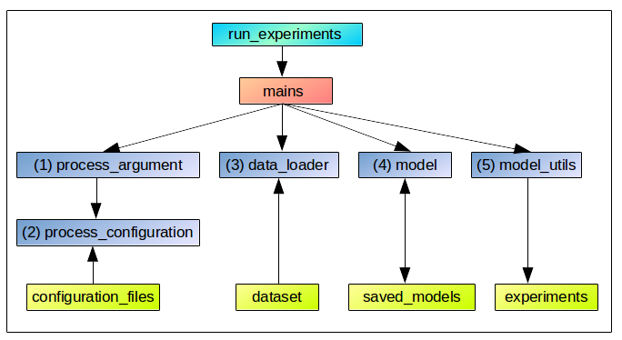
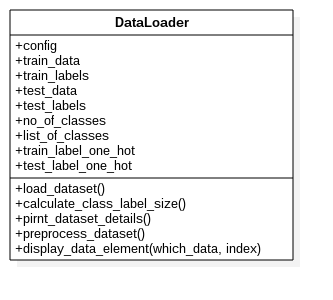
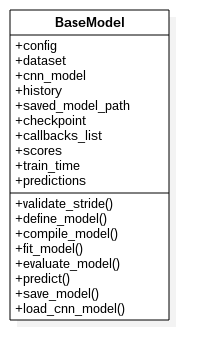
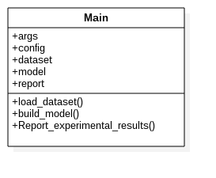
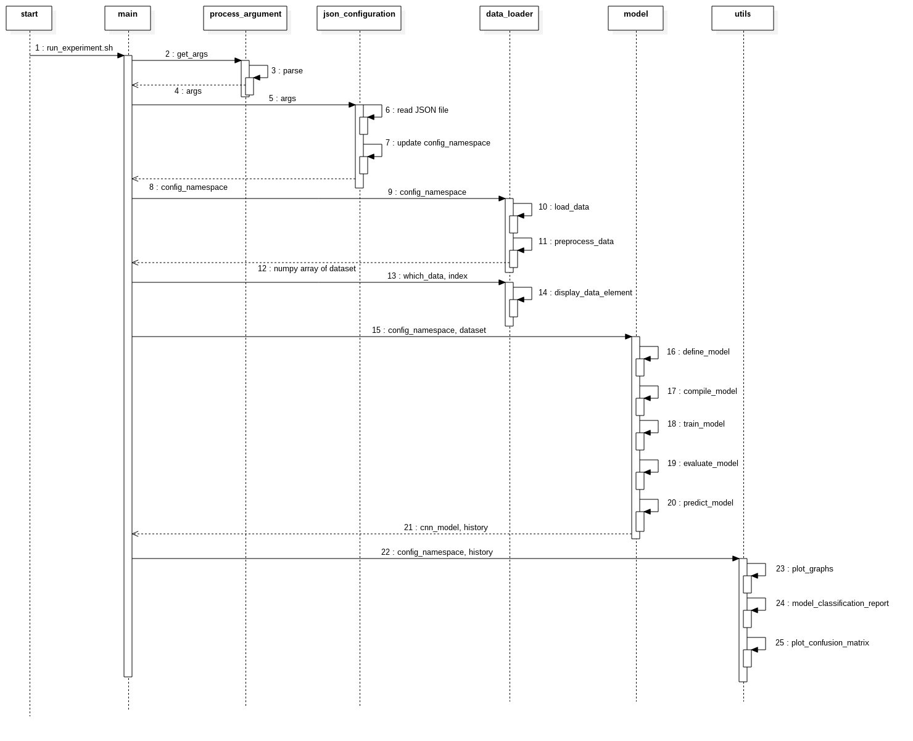

# ConvNet Implementation: An Object Oriented Approach using Keras API.

We aim to construct an object-oriented project template for working with Convolution Neural Networks (ConvNet) through Keras API. This template provides basic structures that helps to simplify the development process for new projects that aims to construct ConvNet models.

# Table Of Contents

- [About](#about): Project details.
- [Installation](#installation-and-execution): Project setup guide.
- [Architecture](#architecture): Architecture description.
    - [Project Structure](##project-structure): File arrangments in different folders.
    - [Architectural Modules](##architectural-modules): Description of the modules.
- [Implementation Example](#implementation-example): Example implementation using the template.
- [Implementation Guidelines](#implementation-guidelines): Guidelines to follow for specific Keras project implementation.
- [Further Reading](#further-reading): References for future reading.
- [FAQs](#Frequently-Asked-Questions): Most frequently asked questions. 
- [Future Works](#Future-Works): Activities in progress.
- [Acknowledgments](#acknowledgments): Acknowledgments.
- [Contributors](#contributors): Project contributors.

# About

This project aims to construct an *Object-oriented* python code to implement Convolution Neural Networks (ConvNet) using Keras API.

A *ConvNet* consists of an input and an output layer, as well as multiple hidden layers. These layers of a ConvNet typically consist of convolutional, pooling, batch normalization, fully connected and normalization layers. 

We provide a simple keras project template that incorporates fundamentals of object-oriented programming to simplify the development process. Using this template one can easily start a ConvNet implementation without having to worry much about the helper classes and concentrate only on the construction, training and testing phases of the deep learning model.

# Installation and Execution

1. Install the dependencies of the project through the command: `pip install -r REQUIREMENTS.txt`
2. Run the ConvNet experiment using the bash-interface: `./run-experiments.sh`

# Architecture

Architectural modules are as depicted in the following figure:



## Project Structure

```
├── requirements                            - Specifies the library dependencies.
|
├── resources                               - This folder holds the project resources.
|
├── run_experiments.sh 	                    - Interface script to run a ConvNet experiment.
|
├── configuration_files     		   		- This folder holds the configuration files for the experiment, in Key:Value pair.
│   ├── template.json                       - Sample configuration file, with all the parameters.
│   ├── fashion_config.json	            	- Configuration file for the Fashion-MNIST experiment.
│   └── stl10_config.json                   - Configuration file for the Stl-10 experiment.
|
├── dataset                                 - This folder houses the dataset for the experiments.
│   └── stl-10                              - Houses the Stl-10 dataset.
|
├── base                                    - Package for abstract base class.
│   ├── data_loader_base.py                 - Abstract Data Loader class to load the dataset. 
│   ├── grid_search_base.py                 - Abstract Grid Search class to find optimal hyperparameters.
│   └── model_base.py                       - Abstract Base Model class to define a ConvNet model.
|
├── data_loader                             - Package for data loader.
│   ├── fashion_mnist_loader.py             - Fashion-MNIST dataset loader.
│   └── stl10_loader.py                     - Stl-10 dataset loader.
|
├── model                                   - Package for ConvNet model definition, training and evaluation.
│   └── fashion_mnist_model.py              - Module to construct the ConvNet for Fashion-MNIST.
|
├── mains                                   - Package for execution pipeline.
│   ├── fashion_mnist_mains.py              - Module for Fashion-MNIST execution pipeline.
│   └── stl10_mains.py                      - Module for Stl-10 execution pipeline.
|
├── hyperparameter_optimization             - Package for hyperparameter grid search.
│   └── grid_search_fashion_mnist.py        - Module for Fashion-MNIST hyperparameter grid search.
|
├── utils                                   - Package for utilites.
|   ├── model_utils.py                      - Module for reporting the experimental results.
|   ├── process_argument.py                 - Module to process the arguments for execution pipeline.
|   └── process_configuration.py            - Module for processing the configuration file.
|
└── experiments                             - This folder holds the experimental results.
	├──	graphs								- This folder holds the plots of loss and accuracy.
	└── saved_models 	                    - This folder holds the saved ConvNet model at specific check points.
```

## Architectural Modules

- ### **Run Experiments**

	- An experiment is a run of the ConvNet model with a different combination of datasets and configuration parameters.
	- *run_experiments* is a shell script that acts as an interface to run a ConvNet experiment. It sets up the python executable path and runs the mains python script.
	- Several arguments control the ConvNet model's execution. They are described below:
		- **Experiment options:**
			1. *-x, --experiment*: Indicates name of the experiment to be run. As of now, acceptable values are: *fashion-mnist* for Fashion-MNIST dataset and *stl-10* for STL-10 dataset.
			2. *-c, --config*		Specifies the path to the configuration file.
			3. *-e, --epoch*		Specifies the number of training epochs.

		- **Other options:**
			1. *-h, --help*		display this help and exit.
	- An example to run an experiment on Fashion-MNIST dataset using default configuration parameters: </br>
	`./run_experiments.sh -x fashion-mnist` or `./run_experiments.sh --experiment fashion-mnist`

	- An example to run an experiment on Fashion-MNIST dataset using command line configuration parameters: </br>
		- with epoch size: `./run_experiments.sh -x fashion-mnist -e 5` or `./run_experiments.sh --experiment fashion-mnist --epoch 5` </br>
		- with configuration file and epoch size: `./run_experiments.sh -x fashion-mnist -c fashion_config.json -e 5` 

- ### **Configuration Files**

	- The "configuration files" folder holds the JSON files that contains the configuration parameters to run the ConvNet experiments in Key:Value pairs.
	- Description of these parameters along with their acceptable values are present [here](./resources/parameter_descriptions.md).
	- We also provide a template configuration file located [here](./configuration_files/template.json) that holds all the possible parameters required by the ConvNet experiment.

- ### **Dataset**

	- Dataset folder houses the dataset used for training and testing the ConvNet model.
	- These datasets are the one that are not present in the keras dataset package.

- ### **Base**

	- The base package defines the modules which contain the abstract classes that are to be inherited by a particular ConvNet model.
	- It has the following modules:

	- #### **data_loader_base**
		- It defines an abstract class **DataLoader** that wraps the dataset loading process. 
		- It's class diagram is illustrated in the following figure: </br>
	    	

		- It has the following data members:
		    - *Train Dataset*: It holds the training dataset.
		        - *train_data*: Its a numpy array that holds training data.
		        - *train_labels*: Its a numpy array that holds training data's labels.
		    - *Test Dataset*: It holds the test dataset.
		        - *test_data*: Its a numpy array that holds test data.
		        - *test_labels*: Its a numpy array that holds test data's labels.
		    - *no_of_classes*: It holds the number of class-labels in the dataset.
		    - *list_of_classes*: It holds the list of all the class-labels in the dataset.
		    
		- It has following data methods:
		    - *load_dataset()*: It loads the training and testing dataset in their respective numpy arrays.
		    - *calculate_class_labelSize()*: It claculates the number of class-labels in the dataset.
		    - *pirnt_dataset_details()*: It prints the dataset details, like shape of the numpy arrays.
		    - *display_data_element()*: It displays a particular data element from training or testing dataset.

	- #### **model_base** 
		- It defines an abstract class **BaseModel** that wraps the ConvNet model's construction process.
		- It also supports the serialization of the model to the disk at particular stages of the execution that can be loaded at later point.
		- Its class diagram is illustrated in the following figure: </br>
	        
	    - It has the following data members:
			- *config*: Holds the configuration parameters parsed from the JSON file.
			- *dataset*: It is an object of the class DataLoader. 
			- *cnn_model*: It holds the type of ConvNet model of the experiment *i.e,* either Sequential or Functional.
			- *history*: It holds the ConvNet training phase's history.
			- *saved_model_path*: It holds the path of the saved ConvNet model.
			- *checkpoint*: It specifies the checkpoints for training phase of the ConvNet model.
			- *callbacks_list*: It holds the list of callback functions that are to be traced during the training phase.
			- *scores*: It holds loss and accuracy scores of the ConvNet testing phase.
			- *train_time*: It holds the training time of the ConvNet model.
			- *predictions*: It holds theb predicted class labels of the testing data.

		- It has the following abstract data methods which are to be implemented by the inheriting class:
			- *validateStride()* : For a given filter, it validates the given stride value.
			- *define_model()*: It defines the layers of the ConvNet model.
			- *compile_model()*:  It configures the ConvNet model.
			- *fit_model()*: It trains the ConvNet model.
			- *evaluate_model()*: It evaluates the ConvNet model.
			- *predict()*: It predicts the class label of the testing dataset.
			- *save_model()*: It saves the ConvNet model to the disk.
			- *load_cnn_model()*: It loads the saved model from the disk.
			
- ### **Data Loader**
	
	- The "data_loader" package loads the experiment specific dataset from the Keras library or from a specified path.
	- Each dataset should have a separate module implementation.

- ### **Model**

	- It implements the ConvNet architecture as per the requirements of the experiment.
	- This package holds one specific module for each experiment that designs the model's architecture.

- ### **Mains**
	- The main package wraps the execution flow of the experiment.
	- Depending on the requirement it calls the specific member methods from different modules to perform a specific operation.
	- It's class diagram is illustrated in the following figure: </br>
	

	- The following sequence diagram depicts the execution flow: </br>
	

	- A high level overview of the execution flow is listed below:
		1. The interface script *run_experiments.sh*, accepts the command line arguments from the user that configures the ConvNet model. It then calls the *mains* python script and passes the arguments to it.
		2. *mains* controls and coordinates the execution flow of the experiment. It first obtains the command line arguments and process them through the *get_args* and *process_configuration* scripts in the utils packages. These arguments are then passed to all other modules whenever necessary.
		3. *data loader* script is called next to load and process the dataset.
		4. Once the dataset has been loaded, *model* script is then called by mains that will construct, compile, train and evaluate the convNet model. It also serializes the trained model to the disk if asked to do so. Also, if a test data is given, the model predicts its class label.
		5. Finally, *report* module is called by mains to generate the classification report. It generates loss and accuracy plot per epoch. Also, a confusion matrix is generated to depict the overall classification report of the dataset. These plots are saved in the respective *experiments* folder.
	
- ### **Utils**
	- The utils package contains the modules that are implemented for reporting the experimental results and the add-ons required for the interactive design of the application.

	- *model_utils*
		- This module implements the *Report* class that displays the results in the required format *viz.,* Graphs, Tables, Matrix *etc*.
		- It has following data methods:
			- *plot_confusion_matrix()*: Displays the prediction results in the matrix form w.r.t True Positive (TP), True Negative (TN), False Positive (FP) and False Negative (FN).
			- *model_classification_report()*: Displays the classification results in the tabular form that includes precison, recall, f1-score and support.
			- *plot()*: Displays the validation results of loss and accuracy as a graph.

	- *process_argument*
		- This module parses the command line arguments that are passed to the experiment.

	- *process_configuration*
		- Reads the respective JSON file of the experiment and converts it to namespace.
		- It has following data methods:
			- *update_namespace()*: It updates the JSON parameters in the namespace which are passed as the command line arguments.
			- *process_config()*: Parses the configuration parameters that are present in the JSON file.
			- *create_dirs()*: It creates the new directories as per the experimental settings in order to store the results.

# Implementation Example

We provide a sample implementation of the template classes, scripts and modules using Fashion-MNIST dataset. Following are the implementation details.

- *fashion_mnist_loader*
	- It is located under *data_loader* package.
	- It implements the class *FashionMnistLoader* by inheriting the DataLoader class from the base package.
	- It loads the Fashion-MNIST dataset from the keras library in respective NumPy arrays by overloading the *load_dataset()* function.
	- It also processes it through the overloaded function *preprocess_dataset()*.

- *fashion_mnist_model*
	- It is located under *model* package.
	- It implements the class *FashionMnistModel* by inheriting the BaseModel class from the base package.
	- It implements the  define_model(), compile_model(), fit_model(), evaluate_model() and predict() functions to construct, configure, train and evaluate the ConvNet model.
	- The ConvNet model has 13 layers that includes a combination of convolution, Leaky RELU, max-pooling, dropout, flatten and dense layers.
	- It also saves the trained model to disk per epoch only when there is an improvment in the performance.

- *fashion_mnist_mains*
	- It is located under *mains* package.
	- This module contains execution flow of the Fashion-MNIST experiment.
	- It parses the command line arguments, JSON parameters and converts them to dictionary structure.
		
# Implementation Guidelines

With this template one can implement a Deep Learning project using ConvNet models. We provide the following list of guidelines in order to describe the development process:

1. Create a .json file in the **configuration_files** folder that holds the configuration parameters. We have provided a template file in the folder that defines all the possible parameters.

2. Define a project specific **Data Loader** class in a module in the *data_loader* package. This class should inherit the *DataLoader* base class from the *base* package. 
```python
class SpecificLoader(DataLoader):
	def __init__(self, config):
		super().__init__(config)
		return
```
- Override the **load_dataset()** and **preprocess_dataset()** function in this class to perform the data loading and processing operations respectively.
```python
	def load_dataset():
		"""
		Implement this method in the inherited class to read the dataset from the keras dataset library/disk.
		Update respective data members of the DataLoader class. 
		"""
		return

	def preprocess_dataset():
		"""
		Implement this method in the inherited class to pre-process the dataset.
		Data values in the training and testing dataset should be in floating point values and
		the class labels are to be in one-hot encoded vector.
		"""
		return
```

3. Define a project specific **Model** class in a module in the *model* package. This class should inherit the *BaseModel* class from the *base* package.
```python
class SpecificModel(BaseModel):
	def __init__(self, config, dataset):
		super().__init__(config, dataset)
		return
```
- Override the following functions in this class to perform the model construction, configuration, training and evaluation.
```python
def define_model(self):
	"""
	Construct the ConvNet model.
	"""
	return model

def compile_model(self):
	"""
	Configure the ConvNet model.
	"""
	return

def fit_model(self):
	"""
	Train the ConvNet model.
	"""
	return

def evaluate_model(self):
	"""
	Evaluate the ConvNet model.
	"""
	return
```

4. Create a class **Main** in a module in the *mains* package. This class is responsible for the execution flow of the experiment. Implement the following in the class:
	- Get the command line arguments and parse the JSON configuration file.
	- Instantiate the data loader class by passing the configured parameters.
	- Instantiate the model class by passing the configured parameters and data loader's object. The constructor will call the overridden functions to construct, configure, train and evaluate the ConvNet model.
	- Generate the classification report by creating an object of the class Report in the utils package and call the plot(), model_classification_report() and plot_confusion_matrix() functions.

```python
try:
	# Capture the command line arguments from the interface script.
	args = get_args()
	# Parse the configuration parameters for the ConvNet Model.
	config = ConfigurationParameters( args )
except:
	print( 'Missing or invalid arguments !' )
	exit(0)

# Load the dataset from the library, process and print its details.
dataset = SpecificLoader(config)

# Construct, compile, train and evaluate the ConvNet Model.
model = SpecificModel(config, dataset)

# Generate graphs, classification report and confusion matrix.
report = Report(config,  model)
report.plot()
report.model_classification_report()
report.plot_confusion_matrix()
```

# Further reading

Work in progress.

# Frequently Asked Questions

Work in progress.

# Future Works

- To perform the experiments for ConvNet by :
	- Implementing it with different layer architecture.
	- Observing the effects of configuration parameters on the training phase.
- Support for other standard machine learning datasets.
- Implementation of ConvNet model for multimodal datasets.
- Support for other deep learning techniques like RNN, Autoencoders, etc.

# Acknowledgements

- The project was inspired from [Tensorflow-Project-Template](https://github.com/MrGemy95/Tensorflow-Project-Template).

# Contributors

- Santosh Pattar, Research Scholar, Department of Computer Science and Engineering, University Visvesvaraya College of Engineering. email: <santoshpattar01@gmail.com>

- Veerabadrappa, Graduate Student, Department of Computer Science and Engineering, University Visvesvaraya College of Engineering. email: <veeru4998@gmail.com>

- Dr. Venugopal K R, Professor, Department of Computer Science and Engineering, University Visvesvaraya College of Engineering. email: <venugopalkr@gmail.com>

- We appreciate and welcome any kind of comments and suggestions to improve the work.